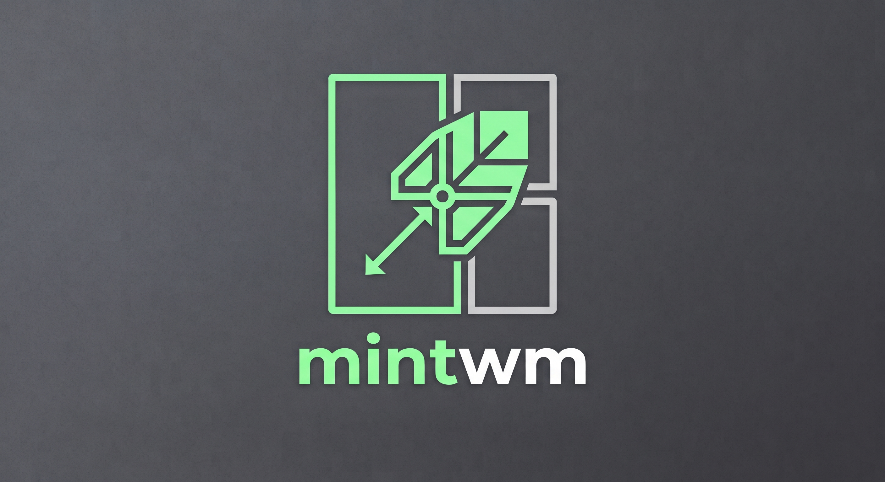

<p align="center">
  
</p>

<h1 align="center">mintwm</h1>

<p align="center">
  <strong>A modular, Plan 9-inspired dynamic tiling Wayland compositor built on wlroots.</strong>
</p>

<p align="center">
  
  
  
  
  
</p>

---

## Table of Contents

- [Overview](#overview)
- [Philosophy & Design](#philosophy--design)
- [Features](#features)
- [The Mint Ecosystem](#the-mint-ecosystem)
- [Default Keybindings & Chord Modes](#default-keybindings--chord-modes)
- [Writing a Custom Key Daemon (keysd)](#writing-a-custom-key-daemon-keysd)
  - [The Key Grab Protocol](#the-key-grab-protocol)
  - [Modifiers Bitmask](#modifiers-bitmask)
  - [Daemon Responses](#daemon-responses)
  - [Example: A Complete Python Key Daemon](#example-a-complete-python-key-daemon)
  - [Running Your Custom Daemon](#running-your-custom-daemon)
- [IPC & Scripting](#ipc--scripting)
  - [Command Reference](#command-reference)
  - [CLI Tool: mintctl](#cli-tool-mintctl)
  - [FUSE Virtual Filesystem: mint-fs](#fuse-virtual-filesystem-mint-fs)
  - [Event Streaming](#event-streaming)
- [Building & Installation](#building--installation)
  - [Dependencies](#dependencies)
  - [Compiling with Make](#compiling-with-make)
  - [Compiling with Nix](#compiling-with-nix)
  - [Feature Toggles (config.mk)](#feature-toggles-configmk)
- [Getting Started & Autostart](#getting-started--autostart)
- [License](#license)

---

## Overview

**mintwm** is a minimalist, fast, and hackable dynamic tiling Wayland compositor built on `wlroots 0.20`. Combining the dynamic master-and-stack layout model of classic tiling window managers with modern Wayland protocols, window swallowing, smart gaps, and pointer constraints for gaming, `mintwm` delivers an uncompromising keyboard-centric desktop experience.

Unlike monolithic compositors that pack status bars, hotkey engines, and complex widget toolkits into a single binary, `mintwm` embraces the **UNIX philosophy** and **Plan 9 concepts**: the compositor handles display and window management, while input handling, hotkeys, status information, and automation are delegated to clean, decoupled companion daemons and standard filesystem interfaces.

---

## Philosophy & Design

1. **Do One Thing and Do It Well**: The core compositor (`mint`) manages surfaces, scene graph rendering, layouts, and window lifecycles. It does not bloat itself with bar rendering, desktop background configuration, or custom scripting languages.
2. **Separation of Concerns via IPC**: Keyboard bindings and modal chords are delegated to a dedicated daemon (`mint-keysd`), which communicates with the compositor over a UNIX domain socket. If you prefer to write your own hotkey daemon in Python, Rust, or POSIX shell, you can.
3. **"Everything is a File" (Plan 9 Ethos)**: With `mint-fs`, the compositor state and control interfaces are mounted as a standard virtual filesystem. Switching a workspace is as simple as `echo 2 > ~/.mint/current_workspace`, and retrieving the active window title is `cat ~/.mint/title`.
4. **Zero Waste & Extreme Efficiency**: Engineered with aggressive memory management (glibc arena throttling and active heap trimming post-window destruction), keeping heap usage minimal and freeing unneeded pages back to the operating system immediately.

---

## Features

### 🪟 Dynamic Tiling
- **Master-and-Stack Layout**: Automatic placement of primary work in the master area and secondary tasks in the stack.
- **Adjustable Split Ratio (`mfact`)**: Fine-tune the master area factor at runtime (0.1 to 0.9).
- **Master Swapping & Cycling**: One-keystroke master promotion (`swap`) and bidirectional focus cycling (`focus next` / `focus prev`).
- **Per-Window Fullscreen**: Toggle true fullscreen on any focused surface.

### 🍽️ Window Swallowing
- **Terminal Swallowing**: When a GUI program (e.g. image viewer, video player, PDF reader) is launched from a terminal emulator, the terminal automatically hides ("swallows"), restoring its position seamlessly when the child closes.
- **Manual Swallowing Toggle**: Toggle swallowing on or off on demand via IPC or keybinding (`toggle_swallow`).
- **Auto-Swallow Controls**: Configure or toggle automatic swallowing behavior globally at runtime (`auto_swallow on|off|toggle`).

### 📐 Window Gaps & Smart Gaps
- **Configurable Margins & Gaps**: Clean outer margins and inner spacing between adjacent tiled windows.
- **Smart Gaps**: Gaps automatically disable when only one window is present on the workspace, maximizing usable screen space without manual intervention.
- **Runtime IPC Control**: Dynamically adjust gap sizes (`gaps +5`, `gaps -5`, `gaps 16`) or toggle gaps on and off (`toggle_gaps`).

### 🎮 Gaming & 3D Acceleration Ready
- **Relative Pointer (`wp_relative_pointer_v1`)**: Unbounded mouse delta reporting for first-person shooters, 3D modeling tools (Blender), and virtual cameras.
- **Pointer Constraints (`wp_pointer_constraints_v1`)**: Complete support for cursor locking and confinement inside window regions with warp hints.

### 🛡️ Modern Wayland Protocols
- **Session Locking (`ext-session-lock-v1`)**: Full compatibility with secure Wayland lockscreens such as `hyprlock` and `swaylock`.
- **Layer Shell (`wlr-layer-shell-unstable-v1`)**: Native integration with status bars (Waybar, mintbar), application launchers (fuzzel, wofi, rofi-wayland), notifications (mako, dunst), and wallpaper daemons (wbg, swww).
- **Screen Capture (`wlr-screencopy-unstable-v1`)**: Screencasting and screenshotting support for `grim`, `slurp`, and OBS Studio.
- **Clipboard Integration**: `wlr-data-control-v1`, `ext-data-control-v1`, and primary selection (middle-click paste).
- **Decorations & Output Management**: Server-side decoration negotiation (`xdg-decoration`) and output configuration (`xdg-output`).
- **XWayland Support**: High-performance, rootless X11 backward compatibility.

---

## The Mint Ecosystem

The `mintwm` suite consists of independent, interoperable components:

| Component | Description |
|---|---|
| **`mint`** | The core Wayland compositor and window manager. |
| **`mint-keysd`** | Standalone keyboard shortcut daemon featuring modal chords and XKB key handling. |
| **`mintctl`** | Lightweight command-line utility for dispatching commands and querying compositor state. |
| **`mint-fs`** | FUSE3 virtual filesystem translating reads and writes into compositor IPC calls. |
| **`mintbar`** | Minimalist companion status bar (available in the `mintbar` repository). |

---

## Default Keybindings & Chord Modes

Keybindings in `mint-keysd` are defined in `config.h` (copied from `config.def.h`). By default, the main modifier key is `MODKEY` (Super / Logo key).

### Normal Mode Bindings

| Keybinding | Action / Command |
|---|---|
| `Super + Return` | Launch terminal (`footclient`) |
| `Super + Shift + q` | Close focused window (`close`) |
| `Super + j` | Focus next window (`focus next`) |
| `Super + k` | Focus previous window (`focus prev`) |
| `Super + Shift + Return` | Swap focused window with master (`swap`) |
| `Super + f` | Toggle fullscreen mode (`fullscreen`) |
| `Super + s` | Toggle window swallowing (`toggle_swallow`) |
| `Super + g` | Toggle window gaps (`toggle_gaps`) |
| `Super + 1-9` | Switch to workspace 1–9 |
| `Super + Shift + 1-9` | Move focused window to workspace 1–9 |
| `Super + Tab` | Switch to previous workspace (`workspace back`) |
| `Super + Shift + e` | Exit compositor (`exit`) |

### Modal Chord System

`mint-keysd` supports modal leader chords with automatic timeouts (default: 2 seconds) and cancellation:

#### Launcher Chord: `Super + d`
Press `Super + d`, release, then press:
- `d` → Launch application launcher (`dmenu_run_history`)
- `p` → Launch password manager (`passmenu2 -i`)
- `c` → Launch calculator (`=`)
- `Escape` → Cancel chord mode

#### Workspace Chord: `Super + w`
Press `Super + w`, release, then press:
- `1-9` → Switch to workspace 1–9
- `Tab` → Switch back to previous workspace
- `Escape` → Cancel chord mode

---

## Writing a Custom Key Daemon (keysd)

One of the foundational design choices of `mintwm` is the separation of keyboard policy from the compositor core. Instead of hardcoding shortcut logic inside the compositor or forcing you to use C, `mintwm` exposes an interactive key-grabbing IPC interface.

You can write your own key daemon in **any language**—Python, Go, Rust, POSIX shell, or C—with custom modal states, vim-like chord engines, or dynamic application bindings.

### The Key Grab Protocol

All communication occurs over the UNIX domain socket (`$XDG_RUNTIME_DIR/mint-ipc.sock`):

1. **Connect**: Open a stream connection to the IPC socket.
2. **Grab Keys**: Send the command `grab_keys\n`. The compositor returns `OK key grab active\n`.
3. **Handle Events**: For every key event, the compositor intercepts the key and synchronously sends a single line formatted as:
   ```text
   KEY <modifiers> <sym> <raw_sym> <state>\n
   ```
   - `<modifiers>`: An integer bitmask of active modifiers (Shift, Ctrl, Alt, Logo/Super).
   - `<sym>`: The keysym translated with active layout and shift state (e.g. `0x21` for `!`).
   - `<raw_sym>`: The base keysym at level 0, ignoring Shift (e.g. `0x31` for `1`, making bindings like `Super+Shift+1` trivial).
   - `<state>`: `1` for key press (down), `0` for key release (up).
4. **Respond**: Your daemon **must respond** with a single newline-terminated reply:
   - `PASS\n` — Forward the keystroke to the focused application (e.g., for unmapped keys and all key releases).
   - `SWALLOW\n` — Consume the keystroke (suppress it from the client) without running any window manager command (useful for chord prefix keys or canceling modes).
   - `<command>\n` — Consume the keystroke and immediately execute an IPC command (e.g., `close\n`, `workspace 2\n`, `sh footclient\n`, `toggle_gaps\n`).
5. **Release**: On exit, send `ungrab_keys\n` or close the socket.

> [!NOTE]
> **Safety Guarantee**: The compositor expects a response within **10 ms**. If your daemon crashes, hangs, or disconnects, the compositor safely releases the grab and falls back to normal key passthrough, preventing your desktop from freezing.

### Modifiers Bitmask

The `<modifiers>` field is a bitwise OR of the standard Wayland/wlroots modifier mask:

| Modifier | Bit Shift | Integer Value |
|---|---|---|
| **Shift** | `1 << 0` | `1` |
| **Ctrl** | `1 << 2` | `4` |
| **Alt** | `1 << 3` | `8` |
| **Logo / Super** | `1 << 6` | `64` |

Common combinations:
- `Super`: `64`
- `Super + Shift`: `65` (`64 | 1`)
- `Super + Ctrl`: `68` (`64 | 4`)
- `Super + Alt`: `72` (`64 | 8`)

### Daemon Responses

| Response | Effect | Example Use Case |
|---|---|---|
| `PASS` | Sends key event to focused client | Unhandled keys, normal typing, all key releases (`state == 0`) |
| `SWALLOW` | Suppresses key from client; no WM action | Leader keys (`Super+d`), modal chords, `Escape` to exit mode |
| `<cmd>` | Suppresses key from client; runs WM command | `close`, `swap`, `focus next`, `workspace 3`, `sh rofi -show drun` |

### Example: A Complete Python Key Daemon

Here is a fully functional, self-contained key daemon written in Python using only the standard library. Save this as `~/.config/mint/mykeysd.py`:

```python
#!/usr/bin/env python3
import os
import sys
import socket

# Modifier bitmasks
MOD_SHIFT = 1 << 0  # 1
MOD_CTRL  = 1 << 2  # 4
MOD_ALT   = 1 << 3  # 8
MOD_SUPER = 1 << 6  # 64

# Standard XKB keysym constants (X11/keysymdef.h)
KEY_RETURN = 0xff0d
KEY_ESCAPE = 0xff1b
KEY_TAB    = 0xff09
KEY_Q      = 0x0071
KEY_J      = 0x006a
KEY_K      = 0x006b
KEY_F      = 0x0066
KEY_G      = 0x0067
KEY_S      = 0x0073
KEY_D      = 0x0064
KEY_1      = 0x0031
KEY_9      = 0x0039

def main():
    sock_path = os.getenv("MINT_IPC_SOCKET") or os.path.expandvars("$XDG_RUNTIME_DIR/mint-ipc.sock")
    
    sock = socket.socket(socket.AF_UNIX, socket.SOCK_STREAM)
    try:
        sock.connect(sock_path)
    except Exception as err:
        sys.exit(f"Failed to connect to mintwm socket at {sock_path}: {err}")

    # Register as key grabber
    sock.sendall(b"grab_keys\n")
    stream = sock.makefile("rw", buffering=1, encoding="utf-8")
    
    ack = stream.readline().strip()
    if ack != "OK key grab active":
        sys.exit(f"Failed to activate key grab: {ack}")

    print("Custom Python keysd running!")
    
    # Simple modal chord state
    in_d_chord = False

    try:
        for line in stream:
            parts = line.strip().split()
            if len(parts) != 5 or parts[0] != "KEY":
                continue

            mods = int(parts[1])
            sym = int(parts[2])
            raw_sym = int(parts[3])
            state = int(parts[4])  # 1 = press, 0 = release

            # Always PASS key releases
            if state == 0:
                stream.write("PASS\n")
                continue

            # Handle chord mode (Super + d prefix)
            if in_d_chord:
                in_d_chord = False
                if raw_sym == ord('d'):
                    stream.write("sh dmenu_run\n")
                elif raw_sym == ord('f'):
                    stream.write("sh firefox\n")
                else:
                    stream.write("SWALLOW\n")
                continue

            # Chord Trigger: Super + d
            if mods == MOD_SUPER and raw_sym == KEY_D:
                in_d_chord = True
                stream.write("SWALLOW\n")
                continue

            # Standard Keybindings
            if mods == MOD_SUPER and raw_sym == KEY_RETURN:
                stream.write("sh footclient\n")
            elif mods == (MOD_SUPER | MOD_SHIFT) and (raw_sym == ord('q') or sym == ord('Q')):
                stream.write("close\n")
            elif mods == MOD_SUPER and raw_sym == KEY_J:
                stream.write("focus next\n")
            elif mods == MOD_SUPER and raw_sym == KEY_K:
                stream.write("focus prev\n")
            elif mods == (MOD_SUPER | MOD_SHIFT) and raw_sym == KEY_RETURN:
                stream.write("swap\n")
            elif mods == MOD_SUPER and raw_sym == KEY_F:
                stream.write("fullscreen\n")
            elif mods == MOD_SUPER and raw_sym == KEY_G:
                stream.write("toggle_gaps\n")
            elif mods == MOD_SUPER and raw_sym == KEY_S:
                stream.write("toggle_swallow\n")
            # Workspaces: Super + 1-9 (switch), Super + Shift + 1-9 (moveto)
            elif mods == MOD_SUPER and (KEY_1 <= raw_sym <= KEY_9):
                ws = raw_sym - KEY_1 + 1
                stream.write(f"workspace {ws}\n")
            elif mods == (MOD_SUPER | MOD_SHIFT) and (KEY_1 <= raw_sym <= KEY_9):
                ws = raw_sym - KEY_1 + 1
                stream.write(f"moveto {ws}\n")
            else:
                # Let all other keystrokes through to the active window
                stream.write("PASS\n")

    except (BrokenPipeError, KeyboardInterrupt):
        pass
    finally:
        try:
            sock.sendall(b"ungrab_keys\n")
            sock.close()
        except Exception:
            pass

if __name__ == "__main__":
    main()
```

### Running Your Custom Daemon

To test your custom daemon live:
```bash
# In an open terminal under mintwm:
python3 ~/.config/mint/mykeysd.py
```
*(When a new client runs `grab_keys`, `mintwm` immediately transfers the key grab to the new client.)*

To make it permanent, update your autostart script (e.g. `~/.config/mint/autostart.sh`):
```bash
# Replace mint-keysd with your custom script:
python3 ~/.config/mint/mykeysd.py &
```

---

## IPC & Scripting

The compositor listens on a UNIX domain socket located at:
```bash
$XDG_RUNTIME_DIR/mint-ipc.sock
```
*(Or the path defined in `$MINT_IPC_SOCKET`)*

### Command Reference

| Command | Arguments | Description |
|---|---|---|
| `sh` / `run` / `exec` | `<command>` | Execute shell command asynchronously |
| `workspace` / `ws` | `<1-9 \| next \| prev \| back>` | Switch active workspace |
| `moveto` / `sendto` | `<1-9 \| back>` | Move focused window to workspace |
| `focus` | `<next \| prev \| master>` | Change window focus |
| `swap` / `zoom` | — | Swap focused window with master |
| `fullscreen` | — | Toggle fullscreen for focused window |
| `close` / `kill` | — | Close focused window |
| `toggle_swallow` | — | Toggle swallowing state for focused window |
| `get_swallow` | — | Returns `1` if swallowing, `0` otherwise |
| `auto_swallow` | `<on \| off \| toggle>` | Query or change automatic window swallowing |
| `toggle_gaps` | — | Toggle gaps on/off |
| `gaps` | `<0-100 \| +N \| -N \| on \| off>` | Query or set gap size in pixels |
| `smart_gaps` | `<on \| off \| toggle>` | Query or configure smart gaps |
| `mfact` | `<0.1-0.9 \| +/-0.05>` | Query or set master area ratio |
| `get_workspace` | — | Returns current workspace index |
| `get_workspaces` | — | Returns formatted list with `[active]` workspace |
| `get_title` | — | Returns active window title |
| `status` | — | Returns a JSON string of compositor state |
| `subscribe` | — | Stream real-time state changes as JSON events |
| `exit` / `quit` | — | Terminate the compositor |

---

### CLI Tool: mintctl

`mintctl` provides a command-line interface to the IPC socket:

```bash
# Switch workspaces
mintctl workspace 2
mintctl workspace next
mintctl workspace back

# Control layout and gaps
mintctl mfact +0.05
mintctl gaps 12
mintctl toggle_gaps
mintctl smart_gaps on

# Window operations
mintctl focus next
mintctl swap
mintctl fullscreen
mintctl close

# Launch commands through compositor
mintctl run "footclient"
```

---

### FUSE Virtual Filesystem: mint-fs

`mint-fs` provides a Plan 9-style virtual filesystem. Mount it to any directory:

```bash
# Mount the filesystem
mkdir -p ~/.mint
mint-fs ~/.mint
```

Once mounted, interact with your desktop using standard shell commands:

```bash
# Check current workspace or switch
cat ~/.mint/current_workspace
echo 3 > ~/.mint/current_workspace

# Read active window title
cat ~/.mint/title

# Adjust master factor or gaps
echo 0.55 > ~/.mint/mfact
echo 14 > ~/.mint/gaps

# Control active window
echo close > ~/.mint/windows/active/ctl
echo 2 > ~/.mint/windows/active/workspace

# Unmount when done
fusermount3 -u ~/.mint
```

---

### Event Streaming

You can stream live state updates directly using `mintctl` or `socat`:

```bash
mintctl subscribe
```

Outputs live JSON events whenever windows open, close, or focus changes:
```json
{"workspace":1,"windows":2,"title":"foot","locked":false,"swallowing":false,"auto_swallow":true,"gaps":8,"gaps_enabled":true,"smart_gaps":true}
```

This makes writing custom bars or external scripts trivial with `jq`:
```bash
mintctl subscribe | jq --unbuffered -r '.title'
```

---

## Building & Installation

### Dependencies

Ensure the following development packages are installed:

- **wlroots** (0.20+)
- **wayland-server** & **wayland-scanner**
- **libxkbcommon**
- **pixman-1**
- **fuse3** (optional, required for `mint-fs`)
- **libxcb**, **xcb-ewmh**, **xcb-icccm** (optional, required for XWayland)

On Arch Linux / Debian / Fedora:
```bash
# Arch Linux
sudo pacman -S wlroots wayland wayland-protocols libxkbcommon pixman fuse3 libxcb xcb-util-wm

# Debian / Ubuntu (testing/unstable for wlroots 0.20)
sudo apt install libwlroots-dev libwayland-dev wayland-protocols libxkbcommon-dev libpixman-1-dev libfuse3-dev libxcb1-dev libxcb-ewmh-dev libxcb-icccm4-dev
```

---

### Compiling with Make

1. Clone the repository:
   ```bash
   git clone https://github.com/GroosL/mintwm.git
   cd mintwm
   ```

2. *(Optional)* Copy `config.def.mk` to `config.mk` and `config.def.h` to `config.h` to tweak configuration options:
   ```bash
   cp config.def.mk config.mk
   cp config.def.h config.h
   ```

3. Build the binaries:
   ```bash
   make
   ```

4. Install to your system (`/usr/local/bin` by default):
   ```bash
   sudo make install
   ```

---

### Compiling with Nix

A `flake.nix` is included providing an isolated development shell with all required dependencies:

```bash
# Enter the development environment
nix develop

# Compile
make
```

---

### Feature Toggles (config.mk)

Protocols and features can be compiled in or out via `config.mk`:

| Option | Default | Description |
|---|---|---|
| `XWAYLAND` | `1` | Enable XWayland support for legacy X11 apps |
| `SESSION_LOCK` | `1` | Enable `ext-session-lock-v1` (hyprlock, swaylock) |
| `LAYER_SHELL` | `1` | Enable `wlr-layer-shell-unstable-v1` (bars, wallpapers) |
| `SCREENCOPY` | `1` | Enable `wlr-screencopy-unstable-v1` (grim, slurp, screen record) |
| `RELATIVE_POINTER` | `1` | Enable `wp_relative_pointer_v1` (FPS / 3D gaming) |
| `POINTER_CONSTRAINTS` | `1` | Enable `wp_pointer_constraints_v1` (mouse confinement) |
| `SWALLOWING` | `1` | Enable terminal window swallowing |
| `GAPS` | `1` | Enable window margins and smart gaps |
| `BUILD_MINT_FS` | `1` | Build `mint-fs` FUSE virtual filesystem |
| `BUILD_MINT_KEYSD` | `1` | Build `mint-keysd` keyboard daemon |
| `BUILD_MINTCTL` | `1` | Build `mintctl` CLI tool |

---

## Getting Started & Autostart

Run `mint` directly from a Linux TTY or display manager. Pass a startup script using the `-s` flag:

```bash
mint -s ~/.config/mint/autostart.sh
```

### Example Autostart Script (`~/.config/mint/autostart.sh`)

```bash
#!/bin/sh

# Set Wayland environment variables
export XDG_CURRENT_DESKTOP=mintwm
export MOZ_ENABLE_WAYLAND=1

# Start the keyboard daemon
mint-keysd &

# Mount the Plan 9 virtual filesystem
mkdir -p "$XDG_RUNTIME_DIR/mint"
mint-fs "$XDG_RUNTIME_DIR/mint" &

# Set wallpaper
wbg ~/Pictures/wallpapers/background.png &

# Launch status bar (e.g. mintbar or waybar)
mintbar &

# Launch notification daemon
mako &

# Launch clipboard manager
wl-paste --watch cliphist store &
```

Make sure the script is executable:
```bash
chmod +x ~/.config/mint/autostart.sh
```

---

## License

This project is open source and released under the **[BSD Zero Clause (0BSD) License](LICENSE)**:

```text
Copyright (c) 2026 Leonardo Groos Lago

Permission to use, copy, modify, and/or distribute this software for any
purpose with or without fee is hereby granted.
```
